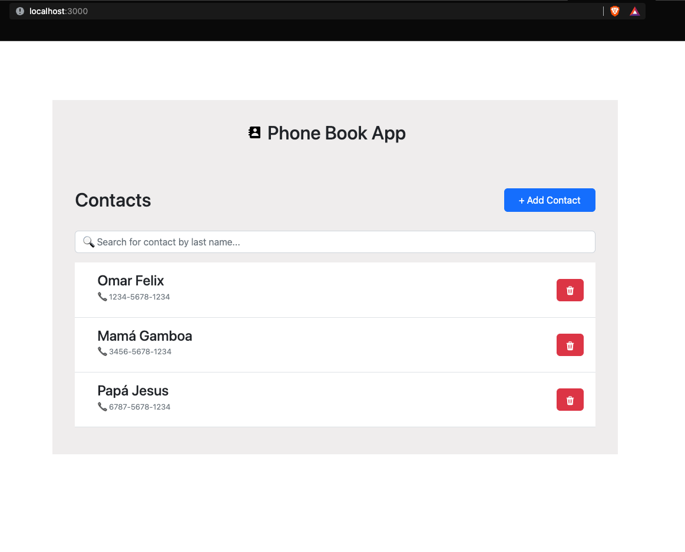

# project-phone-book

The present project is a CRUD to store, read, update and delete contacts. This information is observed through the frontend.

## Technologies:
- Frontend: ReactJS
- Backend: NodeJS, Express
- Database: PostgreSQL

Requirements:
- docker-compose

## Installation

Execute the command: 

```bash
docker-compose up --build
```

## Usage

Go to http://localhost:3000/



## Author

Omar Felix Gamboa ( ofelixg@uni.pe )


